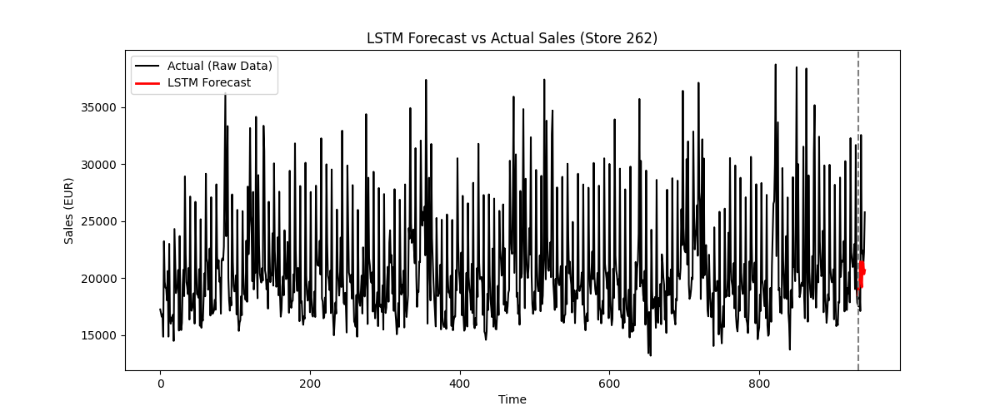

```{r}
suppressPackageStartupMessages({
  library(TSA)
  library(ggplot2)
  library(dplyr)
  library(forecast)
  library(tseries) #Only for the ADF test for testing stationarity
})

```

## Dataset Background

Daily sales records are provided by Rossmann, one of Germany's largest drugstore
chains operating over 3,000 stores across Europe. This dataset contains the daily
sales revenue (in Euros) of Store 262 from 01/01/2013 to 07/31/2015, recorded on
days when the store was open. We are interested in understanding how sales evolved
over time and whether patterns such as seasonal trends can be identified and used
for forecasting.

Source: Kaggle — Rossmann Store Sales Competition
https://www.kaggle.com/competitions/rossmann-store-sales/overview

## Data Loading, Plotting & Train-Test Split

The last 10 data points are held out for testing, with the rest of the series used for training.

```{r}
# Load data
rossmann <- read.csv("../data/train.csv", header = TRUE)

# Filter Store 262, open days only
store262 <- rossmann[rossmann$Store == 262 & rossmann$Open == 1, ]

# Sort chronologically (data is in reverse order)
store262 <- store262[order(store262$Date), ]

# Create ts object (weekly cycle, store open 6 days/week, so frequency = 6)
Y <- ts(store262$Sales, frequency = 6)

# Sample size
T <- length(Y)
T

# Split: last 10 as test
Y_train <- window(Y, end = time(Y)[T - 10])
Y_test  <- window(Y, start = time(Y)[T - 10 + 1])

# Plot
autoplot(Y_train) +
  geom_point(shape = 1, size = 1) +
  labs(title = "Rossmann Store 262 — Daily Sales (Training Set)",
       y = "Sales (EUR)", x = "Time")

```

## SARIMA Model Building

On the training set, following the standard Box-Jenkins procedure: transformation, stationarity testing (ADF), ACF/PACF/EACF order identification, and AIC/BIC-based model selection.

```{r}
# Step 1: Transformation
Y_train_log <- log(Y_train)
Y_test_log  <- log(Y_test)

# Plot to check
autoplot(Y_train_log) +
  geom_point(shape = 1, size = 1) +
  labs(title = "Log-transformed Sales (Training Set)",
       y = "log(Sales)", x = "Time")

# Step 2: ADF test
adf.test(Y_train_log)

# Since the series is stationary, we skip step 3-5
# Step 6: Check the ACF, PACF, and EACF
par(mfrow = c(1, 2))
Acf(Y_train_log)
Pacf(Y_train_log)
eacf(Y_train_log)

# Step 7: Use AIC or BIC to select a final model
# Candidate models based on EACF + seasonal lag=6
m1 <- Arima(Y_train_log, order=c(1,0,2), seasonal=list(order=c(1,0,0), period=6))
m2 <- Arima(Y_train_log, order=c(2,0,2), seasonal=list(order=c(1,0,0), period=6))
m3 <- Arima(Y_train_log, order=c(0,0,2), seasonal=list(order=c(1,0,0), period=6))

# Also check what auto.arima() suggests
auto_fit <- auto.arima(Y_train_log, seasonal = TRUE)
auto_fit

# Compare AIC/BIC
m1; m2; m3

m4 <- Arima(Y_train_log, order=c(0,0,5), seasonal=list(order=c(1,0,0), period=6))
m4

m5 <- Arima(Y_train_log, order=c(0,0,5), seasonal=list(order=c(1,0,1), period=6))
m5

# auto.arima() suggests ARIMA(2,0,3)(2,0,0)[6], which outperforms all manual
# candidates above in both AIC and BIC, with all coefficients significant
m6 <- auto_fit
m6

#Final Model: ARIMA(2,0,3)(2,0,0)[6]
```

## Final Model

$$Y_t (\log(\text{Sales}_t)) = 9.9161 - 0.3482(Y_{t-1}-9.9161) - 0.8795(Y_{t-2}-9.9161) + e_t + 0.5717e_{t-1} + 1.0089e_{t-2} + 0.4077e_{t-3}$$

```{r}
#arima_fit
arima_fit <- m6
arima_fit
```

## Coefficient Significance & Interpretation

Using the rule |coefficient| >= 2 * s.e., all coefficients (ar1, ar2, ma1, ma2, ma3, sar1, sar2, and the mean) are statistically significant.

Unlike our earlier candidate models, this final model — selected by auto.arima() based on AIC/BIC — has every coefficient statistically significant, indicating a clean and well-supported model structure with no redundant terms.

The non-seasonal AR(2)/MA(3) component reflects short-term dynamics: today's sales depend on the past two days' sales levels (AR) and the past three days' random shocks (MA), consistent with short-term carryover effects such as the lingering impact of a one-day promotion.

The seasonal AR(2) terms (lag=6, matching the store's 6-day weekly cycle) capture how sales two weeks back continue to influence today's sales, reflecting a stable, recurring weekly shopping pattern (e.g., consistent weekend peaks).

**Business reasonableness:** Yes, the model is reasonable. It was selected using AIC/BIC, the standard model selection criterion, and all coefficients are statistically significant — indicating the model captures genuine signal rather than noise. The combination of short-term AR/MA dynamics and weekly seasonal AR terms aligns well with how retail sales typically behave.

**Business decisions:** Based on the model, the store can use the AR(2) component to inform short-term inventory adjustments, since today's sales are closely tied to the past two days' levels — a recent upward trend signals the store should restock proactively. The seasonal AR(2) terms (lag=6) suggest staffing and restocking schedules should be planned with a two-week lookback, since sales two weeks prior continue to inform today's expected demand, helping smooth labor and inventory planning across the weekly cycle.

```{r}
#arima_fit
```

## Forecast Evaluation on Test Set

```{r}
#arima_fit
library(Metrics)

arima_pred <- forecast(arima_fit, h = 10)
pred_original <- exp(arima_pred$mean)
rmse(pred_original, Y_test)
```

## Fitted Values & Prediction Intervals

```{r}
# 1. Plot fitted values
autoplot(Y_train_log) +
  autolayer(fitted(arima_fit), series = "Fitted") +
  labs(title = "Fitted Values vs Training Data (log scale)",
       y = "log(Sales)")

# 2. Provide $80\%$ and $95\%$ prediction intervals
# Convert predictions and intervals back to original scale (EUR)
 pred_df <- data.frame(
  Time = as.numeric(time(Y_test)),
  Actual = as.numeric(Y_test),
  Forecast = as.numeric(exp(arima_pred$mean)),
  Lower80 = as.numeric(exp(arima_pred$lower[,1])),
  Upper80 = as.numeric(exp(arima_pred$upper[,1])),
  Lower95 = as.numeric(exp(arima_pred$lower[,2])),
  Upper95 = as.numeric(exp(arima_pred$upper[,2]))
)

train_df <- data.frame(
  Time = as.numeric(time(Y_train)),
  Sales = as.numeric(Y_train)
)

ggplot() +
  geom_line(data = train_df, aes(x = Time, y = Sales), color = "black") +
  geom_line(data = pred_df, aes(x = Time, y = Actual), color = "black") +
  geom_ribbon(data = pred_df, aes(x = Time, ymin = Lower95, ymax = Upper95), 
              fill = "blue", alpha = 0.2) +
  geom_ribbon(data = pred_df, aes(x = Time, ymin = Lower80, ymax = Upper80), 
              fill = "blue", alpha = 0.4) +
  geom_line(data = pred_df, aes(x = Time, y = Forecast), color = "red") +
  labs(title = "Forecast with 80%/95% Prediction Intervals (Original Scale, EUR)",
       y = "Sales (EUR)", x = "Time")

```

```{r}
# Day-by-day percentage error
pct_error <- abs((pred_df$Actual - pred_df$Forecast) / pred_df$Actual) * 100
data.frame(Day = 1:10, Actual = pred_df$Actual, Forecast = round(pred_df$Forecast,1), 
           PctError = round(pct_error,1))
```

**Model fit assessment:** The model fits the data reasonably well. It was selected via AIC/BIC and every coefficient is statistically significant, indicating no redundant terms.

The RMSE on the test set is 4048.2. Looking at the day-by-day forecast errors, most days have errors in the 4-16% range, while Day 5 (32,547 vs predicted 22,298.8, 31.5% error) is a clear outlier, again likely due to a sudden demand spike the model cannot anticipate.

The 80%/95% prediction intervals reasonably cover most actual test values. Overall, the model captures short-term carryover effects (AR/MA) and the recurring two-week seasonal pattern well, but cannot anticipate one-off shocks.

## LSTM Comparison

As a deep learning alternative to SARIMA, an LSTM forecasting model was built for the same task (see `lstm_forecast.py`).

**LSTM RMSE (original scale):** 4712.395



**Comparison — ARIMA vs. LSTM:**

ARIMA outperformed LSTM in this case (RMSE 4048.2 vs 4712.4), which is somewhat different from common expectations that deep learning offers better accuracy. This is likely because: (1) deep learning models typically require large amounts of data to learn robust patterns, but our training set (932 observations) is relatively small; (2) the LSTM used here was a lightweight, single-layer architecture without hyperparameter tuning; and (3) our data exhibits a clear, regular weekly seasonal pattern, which is exactly the type of structure ARIMA is well-suited to capture, leaving less room for LSTM's flexibility to provide an advantage.

Given the interpretability requirement and the strong, regular seasonal structure of retail sales data, ARIMA is the more suitable choice for this business context — it not only forecasts more accurately here, but also produces coefficients (e.g., the weekly seasonal AR term) that directly translate into actionable business insights, such as inventory and staffing decisions.
